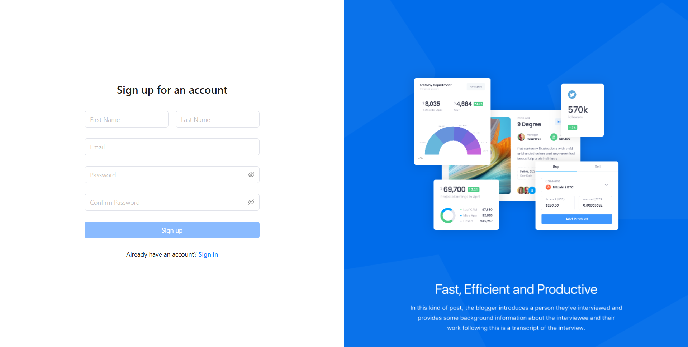
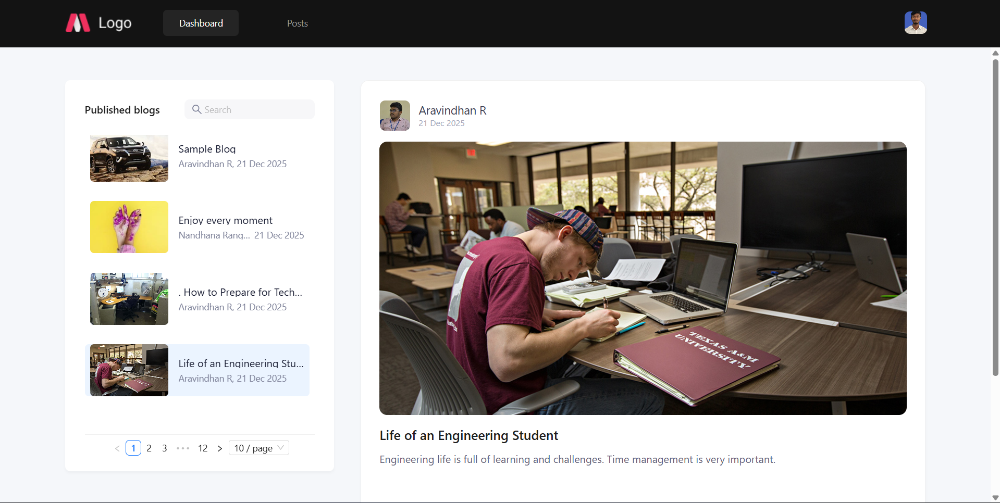
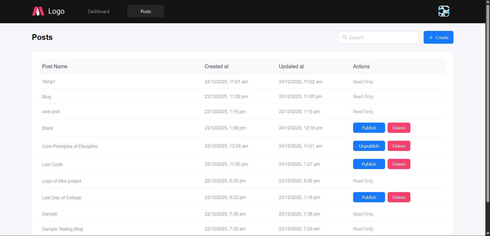
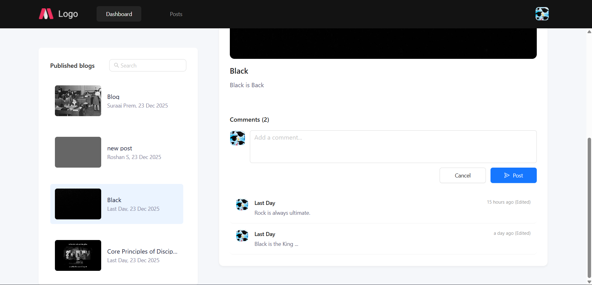
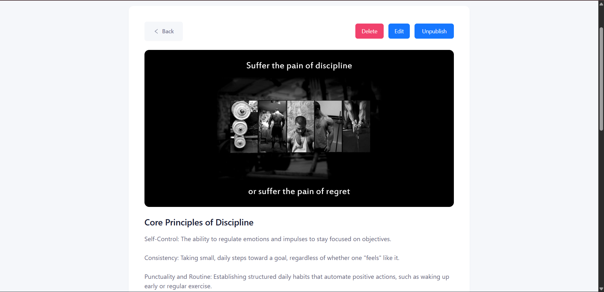
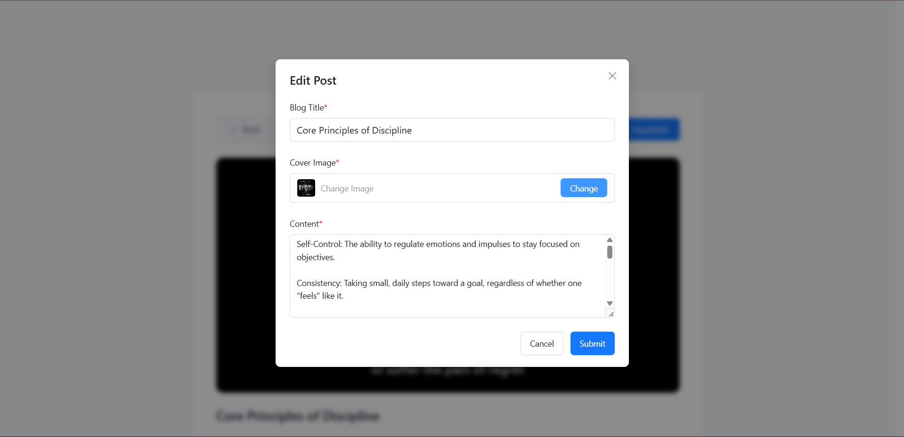

## -- Blog Application -- ##

## Features

User Authentication (Sign In / Sign Up)

Dashboard & Posts Management

Create, Edit, and Delete posts

Image Upload for Posts

Publish / Unpublish Posts Control

Post Preview & Detailed View

Comments System (Add & View Comments)

Profile Management (View & Edit Profile)

Protected Routes (Private/Public access control)

Real-time validation for forms

State management using Redux & Redux-Saga

Clean UI with Ant Design components

Responsive Design for Mobile & Desktop

Protected Routes (Private/Public access control)

Handle Network down scenarios

Handle API errors

Handle form validation errors

## API Endpoint Used

` VITE_API_BASE_URL=https://interns-mini-project.onrender.com/api/v1 `

## Setup Guide

1. Clone the repository

` git clone https://mugeshkannan1-admin@bitbucket.org/mugeshkannan1 mugesh-kannan-s-react-assignments.git `

2. Navigate into the project folder

` cd mugesh-kannan-s-react-assignments `

3. Install dependencies

` npm install antd @ant-design/icons axios dayjs lodash @reduxjs/toolkit react-redux redux-saga react-router-dom `
or
` pnpm install `

4. Setup Environment Variables
   
   Create a `.env` file in the root directory (Week-10) and add the following:

   ` VITE_API_BASE_URL=https://interns-mini-project.onrender.com/api/v1 `

## Start the development server

` npm run dev `
or
` pnpm run dev `

## App will run at:

` http://localhost:3000/ `

## UI Preview

