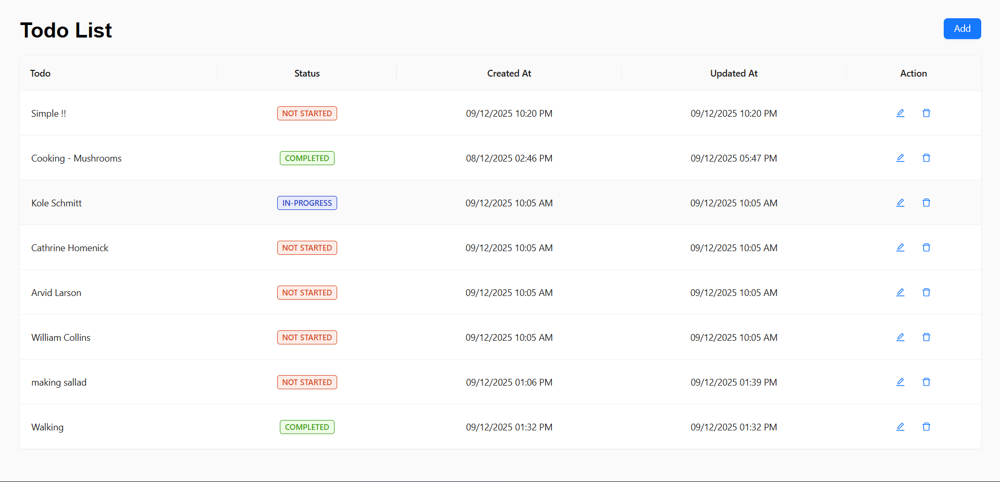

## -- Task Manager App -- ##

## Features

Add new tasks

Edit existing tasks

Delete tasks

Status selection: Completed / In-Progress / Not Started

CreatedAt & UpdatedAt date-time formatting

Real-time validation (submit disabled until valid)

API integrated CRUD operations

Error handling with toast alerts

Clean UI with Ant Design components

## API Endpoint Used

` https://interns-test.onrender.com/api/todos `

## Setup Guide

1.Clone the repository

` git clone https://mugeshkannan1-admin@bitbucket.org/mugeshkannan1/mugesh-kannan-s-react-assignments.git `

2.Navigate into the project folder

` cd Week-08 `

3️.Install dependencies

` npm install antd @ant-design/icons axios dayjs @reduxjs/toolkit react-redux `

## Start the development server

` npm run dev `

## App will run at:

` http://localhost:5173/ `

## UI Preview

